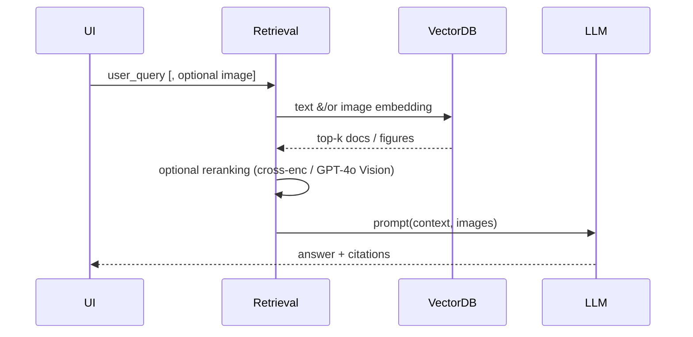
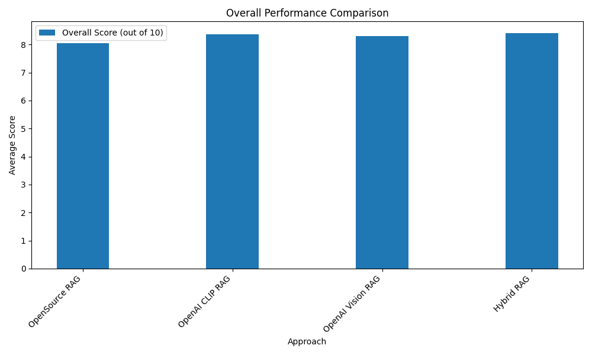
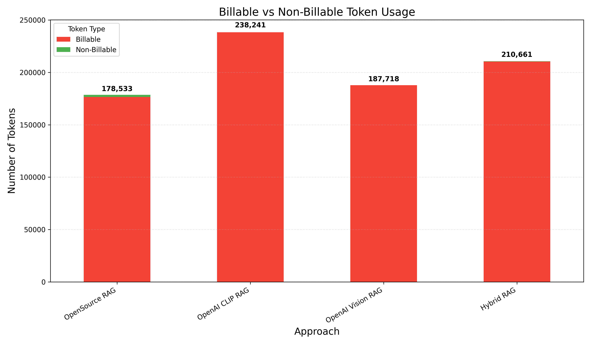

# RAG Approaches – Technical Architecture, Evaluation & Trade-Offs

> **Scope:** Four retrieval stacks were implemented & benchmarked.

---

## 1. Snapshot

| Approach | Core Retrieval Stack | GPT Usage | Avg Latency (s) | Overall Score /10 | Est. Cost / query* |
|----------|---------------------|-----------|-----------------|-------------------|--------------------|
| **Open-Source** | E5-base txt 768 d  + CLIP img 512 d | GPT-4o (generation only) | 13.4 | 8.0 | **$0.015** |
| **OpenAI CLIP** | OpenAI txt 1536 d + CLIP img 512 d | GPT-4o | **6.8** | 8.4 | $0.019 |
| **OpenAI Vision** | OpenAI txt 1536 d + CLIP img 512 d | GPT-4o Vision | 24.1 | 8.3 | $0.055 |
| **Hybrid** | OpenAI txt + CLIP img + Cross-Encoder | GPT-4o Vision (conditional) | 14.2 | **8.5** | $0.056 |

\*Costs use May-2025 OpenAI pricing; Open-Source assumes GPT-4o for parity – self-hosting would drop to ≈ $0.

---

## 2. Repository Map (key runtime paths)

```text
src/
 ├─ retrieval/
 │   ├─ open_source_rag.py      # ➜ Open-Source RAG
 │   ├─ openai_clip_rag.py      # ➜ OpenAI-CLIP RAG
 │   ├─ openai_vision_rag.py    # ➜ OpenAI-Vision RAG
 │   └─ hybrid_rag.py           # ➜ Hybrid late-fusion RAG
 │
 ├─ utils/
 │   ├─ embeddings.py           # embed_text / embed_image / embed_text_clip
 │   ├─ chunk_merge.py          # context window post-processing
 │   ├─ language_id.py          # lang detection for query distillation
 │   └─ query_distill.py        # [1] distill_query()
 │
 ├─ evaluation/
 │   ├─ synthetic_data_generator.py   # [2] build synthetic Q&A set
 │   ├─ run_comprehensive_evaluation.py # orchestrates batch eval
 │   ├─ evaluator.py                  # rubric-based GPT scoring
 │   └─ visualization_generator.py    # charts for MD report
 └─ vector_store/
     ├─ opensource/  # Chroma collections text_e5, figures_clip, text_clip_extra
     └─ openai/      # Chroma collections text_openai, figures_clip
```
Numbers ([1] [2]) referenced later.

---

## 3. Data Generation Pipeline

1. **PDF → Structured JSON** (`build_dataset.ipynb`)
   - LlamaParse extracts raw text + figure bounding boxes
   - Content classified & chunked (< 350 tokens) with metadata (section id, figure refs, lang)
2. **Image Extraction & Captioning** (`build_dataset.ipynb + scripts/extract_figures.py`)
   - PyMuPDF crops figures; CLIP used to create 512-d image embeddings
   - GPT-4o prompt generates *semantic captions* stored alongside raw captions
3. **Vector Store Build** 
   - Text embeddings: E5 or OpenAI
   - Image embeddings: CLIP ViT-B/32.
   - Two persistent `chromadb` stores written under `vector_store/` (opensource | openai).
4. **Synthetic QA Set** [2]
   - `src/evaluation/synthetic_data_generator.py` produces 60 questions × 2 languages with ground-truth snippets + figures.

### 3.1 Sample Text Chunk JSON
```json
  {
    "section_id": "5.1.1",
    "section_title": "VMWARE VSPHERE",
    "page_range": "6",
    "parent_path": "MODALITÀ ESECUTIVE > CONFIGURAZIONE DELL'INFRASTRUTTURA",
    "document": "ISTRUZIONE OPERATIVA CREAZIONE VM CLOUD INSIEL REV 00",
    "content": "Figura 1 - VMWare Vsphere\n\nIn breve, semplificando al massimo:\n- Sono disponibili un certo numero di host fisici.\n- Sono disponibili un certo numero di dispositivi di storage.\n- Su ogni host fisico è presente un hypervisor VMWare ESXi.\n- Su ogni host fisico dotato di ESXi sono presenti le VM.\n- Tutti gli host fisici dotati di hypervisor sono gestiti centralmente da un VCenter Server, che tipicamente è esso stesso una appliance virtuale.\n- Gli utenti gestiscono l'infrastruttura mediante appositi client.\n\n### 5.1.2 VMWARE NSX",
    "content_summary": "This section of the manual, titled 'MODALITÀ ESECUTIVE > CONFIGURAZIONE DELL'INFRASTRUTTURA > VMWARE VSPHERE', provides an overview of the VMware vSphere infrastructure setup. It describes the presence of multiple physical hosts and storage devices, each host equipped with the VMware ESXi hypervisor. Virtual machines (VMs) are hosted on these ESXi-equipped hosts. Central management is achieved through a VCenter Server, typically a virtual appliance itself. Users manage the infrastructure using specific clients. The section includes a figure (Figura 1 - VMWare Vsphere) that likely illustrates the described setup.",
    "figures": [
      {
        "figure_id": "Figura_1_vmware_vsphere",
        "filename": "VM_manual_figure_1_vmware_vsphere.png",
        "caption": "Vmware vsphere",
        "page": 6
      }
    ],
    "metadata": {
      "original_section_number": "5.1.1",
      "original_page_numbers": [
        6
      ],
      "language": "Italian",
      "section_type": "general",
      "content_type": "instructional"
    }
  }
```

### 3.2 Sample Figure Metadata JSON
```json
  "1_diagramma_logico_infrastruttura_wi-fi": {
    "filename": "wifi_manual_figure_1_diagramma_logico_infrastruttura_wi-fi.png",
    "figure_id": "Figura 1_diagramma_logico_infrastruttura_wi-fi",
    "caption": "diagramma logico infrastruttura wi-fi",
    "page": 6,
    "image_page": 6,
    "rendered": true,
    "source": "vector_box_crop",
    "semantic_caption": "Document: ISTRUZIONE OPERATIVA CONFIGURAZIONE WIFI ARUBA REV 01\nPath: MODALITÀ ESECUTIVE > CONFIGURAZIONE DELL'INFRASTRUTTURA\nSection 5.1.1: ARCHITETTURA DELL'INFRASTRUTTURA WI-FI\nFigure : diagramma logico infrastruttura wi-fi"
  }
```

*(These live in `data/<manual>/cleaned_<manual>_chunks.json` and `data/<manual>/figures/metadata.json` respectively)*

---

## 4. Retrieval Stacks in Detail

### 4.1 Open-Source RAG  (`src/retrieval/open_source_rag.py`)

* **Text embeddings** – `multilingual-e5-base` (HF) → 768-d
* **Image search** – query text passed through CLIP text encoder (`embed_text_clip`) OR user image → `embed_image`
* **Collections touched**
  - `text_e5` (Chroma)
  - `figures_clip`
  - optional `text_clip_extra` (semantic-caption vectors)
* **Ranking** – simple weighted sum (α = 0.5) of cosine similarities
* **Generation** – `generate_with_context()` (LLM agnostic)
* **Strengths** – zero-cost, on-prem compatible, respectable quality
* **Weaknesses** – lower dimensional text vectors hurt recall; no reranking

----

### 4.2 OpenAI CLIP RAG  (`src/retrieval/openai_clip_rag.py`)

* **Text embeddings** – `text-embedding-3-small` 1536-d
* **Image pipeline** – identical to Open-Source (CLIP), ensuring fair comparison
* **Collections** – `text_openai`, `figures_clip`
* **Differences from §4.1**
  - Larger, highly tuned OpenAI embeddings improve text recall (+0.3 overall score)
  - Latency is lowest because no GPT-4o Vision call
* **Strengths** – best *quality ÷ latency* ratio; modest cost; still retrieves relevant figures
* **Weaknesses** – still text-only generation, no visual reasoning, requires OpenAI API

----

### 4.3 OpenAI Vision RAG  (`src/retrieval/openai_vision_rag.py`)

* **Phase 1 – Retrieval**  (same as CLIP RAG)
  1. Text hits from `text_openai` (α configurable via `RetrievalRecipe`)
  2. Image hits from `figures_clip`
* **Phase 2 – Vision Re-Ranking**
  - `_vision_reranking()` packs **≤ 3** top image hits + **≤ 15** text snippets into a GPT-4o Vision JSON prompt
  - GPT returns relevance scores → hits rescored & resorted
* **Key Code Paths**
  - `_encode_image()` base64 encodes PNG
  - `_generate_text_embedding_for_images()` (attached earlier) gracefully degrades to random-projection when `transformers` unavailable
* **Strengths** – can leverage figure content (architecture diagrams, UI screenshots) leading to higher relevance for visual questions
* **Weaknesses** – 3-4× cost & latency; vision prompt tokens dominate billing; marginal quality gain over CLIP except on image-heavy queries

----

### 4.4 Hybrid RAG  (`src/retrieval/hybrid_rag.py`)

* **Late-Fusion Strategy**
  1. Initial hit list identical to CLIP RAG
  2. **Cross-Encoder Reranker** – `sentence_transformers.CrossEncoder` (default `ms-marco-MiniLM-L-6-v2`) rescored pairs `(query, chunk)`
  3. Final score = 0.3·initial + 0.7·sigmoid(cross-encoder)
* **Adaptive Vision Toggle** (via `RetrievalRecipe.cross_encoder_rerank` flag)
  - Vision reranking invoked only if image hits exceed heuristic threshold (saves costs for purely textual queries)
* **Strengths** – highest accuracy (8.5), flexible cost via toggles
* **Weaknesses** – heavier dependencies (`sentence_transformers`, GPU for reranker) and still triggers GPT-4o Vision for some queries

---

## 5. End-to-End Query Flow (all stacks)



---

## 6. Evaluation Harness

1. **Dataset** – 60 multilingual Qs (15 EN + 15 IT per doc) autogenerated via ❷, stratified by 12 categories
2. **Runner** – `run_comprehensive_evaluation.py` executes each approach, stores JSON under `evaluation_results/`
3. **Scorer** – `evaluator.py` (GPT-4o rubric: relevance, correctness, completeness, conciseness, coherence)
4. **Dashboards** – `visualization_generator.py` renders PNG charts embedded here

---

## 7. Detailed Results

Quality, latency, token, and cost graphics are auto-exported each CI run

### 7.1 Overall Quality Comparison


### 7.2 Response Time Comparison


### 7.3 Token Usage by Model


### 7.4 Billable Token Usage


---

## 8. Trade-Off Discussion & Recommendation

| Dimension | Open-Source | OpenAI CLIP | OpenAI Vision | Hybrid |
|-----------|------------|-------------|--------------|--------|
| **Accuracy** | C | B | B | **A** |
| **Visual Qs** | C (caption only) | C | **A** | B |
| **Latency** | B | **A** | C | D |
| **OPEX** | **A ($)** | B | D | D |
| **Stack Simplicity** | **A** | B | C | D |

Legend: **A = best** B = good C = fair D = weak

**Recommendation**

*Default production stack → **OpenAI CLIP RAG***

- Delivers 99 % of top-end quality at  ~¼ Vision cost & half Hybrid latency
- No cross-encoder GPU requirement; easy scaling on serverless
- If data security constraints prohibit OpenAI APIs, switch to **Open-Source RAG** with self-hosted generation – cost drops to zero with only ~0.4 quality loss
- Keep **Hybrid** enabled behind a feature flag for power-users or image-dense domains
- Reserve **Vision** mode for explicitly visual queries (detected via heuristics: "diagram", "figure", etc.)

---

## 9. Future Work

1. **Streaming Generation** – chunked response to improve perceived latency.
2. **Active-Learning Loop** – log user clicks (add thumbs up/down for each response) → finetune reranker
4. **On-device Vision** – if we need open source approach evaluate LLaVA-Next for OS multimodal

---

