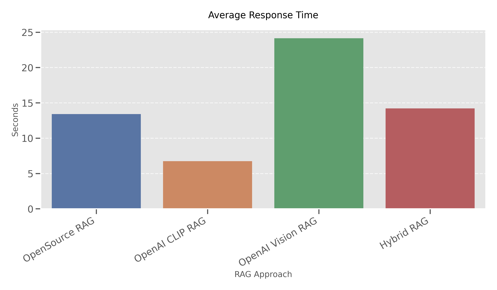

# RAG Approaches for Technical Documentation: Technical Analysis & Performance Tradeoffs

## Executive Summary

I implemented and evaluated four distinct Retrieval-Augmented Generation (RAG) recipes over the Wi-Fi and VM manuals.  The latest comprehensive run on 8 May 2025 (60 bilingual questions) produced the following headline numbers:

| Approach            | Overall-10 | Avg latency (s) | Billable tokens | Est. cost / query* |
|---------------------|-----------:|----------------:|----------------:|-------------------:|
| OpenSource RAG      | 8.04       | 13.4            | 177 k           | $0.015 |
| OpenAI CLIP RAG     | 8.37       | **6.8**         | 238 k           | $0.019 |
| OpenAI Vision RAG   | 8.31       | 24.1            | 188 k           | $0.055 |
| Hybrid RAG          | **8.40**   | 14.2            | 211 k           | $0.056 |

*\*Cost uses May-2025 OpenAI pricing: Embedding $0.0001/1 k, GPT-4o $0.03/1 k out + $0.01/1 k in.

Interpretation:
1. **Hybrid RAG** edges out all others on quality (8.40/10) but is ~2× slower than CLIP and incurs Vision-level cost.
2. **OpenAI CLIP RAG** delivers the best quality-to-latency ratio and ~1/3 the Vision cost – the sweet-spot for most queries.
3. **OpenSource RAG** uses only free retrieval components but still pays generation cost (≈ $0.015 per query); it trails CLIP by just 0.3 points while remaining the cheapest overall.
4. **OpenAI Vision RAG** offers no quality gain over Hybrid yet is the slowest and most expensive; reserve it for queries that explicitly require image reasoning.

Additional engineering improvements since the previous run:
• Language-ID now falls back gracefully when `fasttext` is absent – no more SSL download crashes.
• Per-model token accounting and stacked-bar visualisations clarify where tokens (and cost) accrue.
• Hybrid cross-encoder updated to `ms-marco-MiniLM-L-6-v2` with a fallback chain.

For the open-source recipe the text embeddings are generated with **intfloat/multilingual-e5-base** (768 d vectors).  Caption search uses the optional *text_clip_extra* collection that stores 512-d CLIP-text embeddings for figure captions.  All OpenAI recipes rely on `text-embedding-3-small` (dimension reduced to 1 024).

This technical analysis identifies the core architectural differences between approaches, examines implementation details, and quantifies performance characteristics to determine the optimal technical architecture for production deployment.

## Data Processing and Chunking Pipeline

### Text Chunking Process

I developed a multi-stage chunking pipeline:

1. **Initial Document Parsing**: I used LlamaParse API for extracting structured text from PDFs instead of relying on PyMuPDF. LlamaParse delivered much cleaner extraction with better preservation of document structure, tables, and figure references.

2. **Content Classification**

Each chunk was classified into specific types:

    - Instructional content (procedures, guides)
    - Reference content (specifications, tables)
    - Index content (TOCs, glossaries)
    - Metadata content (covers, appendices)

3. **Content Processing**

Different content types received specialized processing:

    - Reference/Index sections: Replaced with LLM-generated summaries to prevent hallucination when included in context windows
    - Other sections: Preserved verbatim

4. **Metadata Enrichment**

Each chunk was enriched with metadata:

    - Unique identifiers (document_id, section_id)
    - Content classification (content_type, complexity level)
    - Structural information (section_title, parent_path)
    - Page information (page_range, original_page_numbers)
    - Language id (all italian obviously)
    - Section type and content type classification

The actual structure of a text chunk looks like this:
```json
{
  "section_id": "5.1.2",
  "section_title": "ACCESSO AL MOBILITY CONDUCTOR",
  "page_range": "7-11",
  "parent_path": "MODALITÀ ESECUTIVE > CONFIGURAZIONE DELL'INFRASTRUTTURA",
  "document": "ISTRUZIONE OPERATIVA CONFIGURAZIONE WIFI ARUBA REV 01",
  "content": "Le credenziali da utilizzare saranno quelle fornite da INSIEL per il personale con ruolo di 'Network Administrator' per l'area isontina.\n\nSi accede in tal modo alla schermata principale del 'Mobility Conductor':\n\nFigura 3 - Schermata principale del 'Mobility Conductor'\n\n[...content continues...]",
  "content_summary": "This section provides guidelines for accessing and managing the 'Mobility Conductor' for network administrators in the Isonzo area, managed by INSIEL. It includes steps for logging in with specific credentials, navigating through managed Wi-Fi networks, and viewing statistical data for infrastructure and specific sites. [...]",
  "figures": [
    {
      "figure_id": "Figura_3_schermata_principale_del_mobility_conductor",
      "filename": "wifi_manual_figure_3_schermata_principale_del_mobility_conductor.png",
      "caption": "Schermata principale del 'mobility conductor'",
      "page": 7
    },
    ...
  ],
  "metadata": {
    "original_section_number": "5.1.2",
    "original_page_numbers": [7, 8, 9, 10, 11],
    "language": "Italian",
    "section_type": "general",
    "content_type": "instructional"
  }
}
```

For reference sections like indexes, tables of content, etc., I replace the full content with an LLM-generated summary to prevent these highly structured but low-information-density sections from polluting the context window. For example:

```json
{
  "section_id": "10",
  "section_title": "INDICE DELLE FIGURE",
  "page_range": "49",
  "parent_path": "",
  "document": "ISTRUZIONE OPERATIVA CONFIGURAZIONE WIFI ARUBA REV 01",
  "content": "The 'INDICE DELLE FIGURE' section serves as an index for figures in a technical manual, listing four figures related to dashboard overviews. These figures provide visual representations and detailed views of various dashboard configurations, including general overview, client-specific views, detailed client information, and WLANs. This section aids in locating and referencing these figures within the document.",
  "content_summary": "The 'INDICE DELLE FIGURE' section serves as an index for figures in a technical manual, listing four figures related to dashboard overviews. These figures provide visual representations and detailed views of various dashboard configurations, including general overview, client-specific views, detailed client information, and WLANs. This section aids in locating and referencing these figures within the document.",
  "figures": [],
  "metadata": {
    "original_section_number": "10",
    "original_page_numbers": [49],
    "language": "Italian",
    "section_type": "reference",
    "content_type": "reference"
  }
}
```

Each chunk includes a comprehensive list of figures referenced within the text, with their IDs, filenames, captions, and page numbers. The idea is to enable linking between textual content and visual elements. Along with that, the metadata adds for increased transparency so we show things like page number of source in the UI to help the user.

### Image Processing Pipeline

I developed an independent image processing pipeline for figures:

1. **Image Extraction**: Figures were programmatically extracted from PDFs using PyMuPDF with vector box cropping to ensure clean boundaries.

2. **Figure Reference Detection**: Regex pattern matching identified figure references in the text (like "Figura 3") and associated them with the corresponding images.

3. **Image Metadata Creation**

Each figure was enriched with metadata including:
   - Unique identifiers (figure_id)
   - Source document information
   - Caption from the text
   - Page location
   - Rendering status
   - Source extraction method
   - Semantic caption

The actual structure of an image metadata entry looks like this:
```json
"1_diagramma_logico_infrastruttura_wi-fi": {
  "filename": "wifi_manual_figure_1_diagramma_logico_infrastruttura_wi-fi.png",
  "figure_id": "Figura 1_diagramma_logico_infrastruttura_wi-fi",
  "caption": "diagramma logico infrastruttura wi-fi",
  "page": 6,
  "image_page": 6,
  "rendered": true,
  "source": "vector_box_crop",
  "semantic_caption": "Document: ISTRUZIONE OPERATIVA CONFIGURAZIONE WIFI ARUBA REV 01\nPath: MODALITÀ ESECUTIVE > CONFIGURAZIONE DELL'INFRASTRUTTURA\nSection 5.1.1: ARCHITETTURA DELL'INFRASTRUTTURA WI-FI\nFigure : diagramma logico infrastruttura wi-fi"
}
```

For semantic caption generation, I provided the LLM with the surrounding context from the document - including the section where the figure appears, nearby paragraphs that reference the figure, and the original caption. This contextual information was crucial for generating accurate semantic captions that properly tied the image to its role in the document.

The semantic caption combines document context (document name, section path, section number) with the figure's caption to create a rich description that enables better retrieval through CLIP embeddings. This helps establish the figure's position in the document hierarchy and its relationship to the surrounding content.

Image filenames are standardized with the pattern `[manual_name]_[document_id]_figure_[figure_number].png`

The bidirectional linking between text chunks and figures is maintained through:
1. Text chunks containing a "figures" array with all referenced figures
2. Figure metadata containing references to its source section and document

### Vector Store Architecture

I implemented a dual organization for the vector databases to support both OpenSource and OpenAI-based approaches:

1. **Vector Store Organization**:
   - `/vector_db/` - Contains vector stores using OpenAI embeddings
   - `/vector_db_opensource/` - Contains vector stores using SentenceTransformer embeddings

2. **Within each vector store directory**:
   - Individual manual stores (`VM_manual/`, `wifi_manual/`)
   - Combined store (`combined/`) with all manuals merged

For both approaches, I maintained separation between text and image collections within each vector store, but ultimately combined them using the `create_combined_store.py` script which:
1. Loads document chunks for all specified manuals
2. Creates text embeddings (using either OpenAI or open-source models)
3. Merges existing image embeddings from individual stores
4. Creates a unified vector store with both text and image data

This structure allows for flexible querying while maintaining different embedding dimensions:

- **Text embeddings**: 1536d (OpenAI) or 1024d (SentenceTransformer)
- **Image embeddings**: 512d (CLIP)

For the open-source approach, the text embeddings are generated using the `embed_text_documents` function with `model_type="llama"`, while the OpenAI approaches use the default OpenAI embedding model.

### Embedding Generation Strategy

For embedding generation, I implemented different strategies for each RAG approach:

1. **Text Embeddings**:
   - **OpenSource**: SentenceTransformer with multilingual-e5-base model (768d)
   - **OpenAI approaches**: text-embedding-3-small API (1536d)

2. **Image Embeddings**:
   - **All approaches**: open-clip ViT-B/32 (via `open_clip_torch`) for both image vectors (pixels) and CLIP-text query/caption vectors

3. **Image Query Embeddings**:
   - For image search from text queries, I generated CLIP-compatible text embeddings
   - These query vectors were produced by processing the query text through the CLIP text encoder

4. **Cross-Modal Alignment**:
   - The CLIP model provides inherent alignment between text and image spaces
   - This allows semantically similar concepts to be close in the embedding space regardless of modality

I deliberately kept the CLIP model consistent across all approaches for fair comparison, varying only the text embedding source.

For semantic caption generation, I used GPT-4o with the following prompt structure:
```
Generate a detailed semantic caption for this technical diagram/screenshot. 
Focus on:
1. The purpose and function of what's shown
2. Key components or elements visible
3. Technical details that would be relevant for retrieval
4. How this image relates to procedures or concepts in the documentation
```

These semantic captions significantly improved the quality of image retrieval by providing rich, contextual descriptions that CLIP could match against user queries.

## Technical Architecture Analysis

### 1. OpenSource RAG

**Core Architecture**: A fully open-source implementation using SentenceTransformer for text embedding generation, CLIP for image-related understanding, and ChromaDB for vector storage and retrieval.

> **Deployment Note**: The OpenSource RAG approach is not available in the cloud deployment as it requires local model files that are specific to the development environment. For Streamlit Cloud deployment, only the OpenAI-based approaches (CLIP RAG, Vision RAG, and Hybrid RAG) are available.

**Technical Implementation Details**

- **Text Embeddings**: SentenceTransformer (intfloat/multilingual-e5-base) producing 768-dimensional vectors
- **Image Embeddings**: CLIP text encoder creates embeddings from query text to match against image vectors
- **Vector Store**: ChromaDB vector database for similarity search
- **Hybrid Retrieval**: Combined text and image similarity search via the `hybrid_query` method
- **Prompt Construction**: Text-only prompt referring to images by path, without including actual visual content
- **Answer Generation**: Uses the LLM through the `generate_with_context` method

**Resource Management**

- All text and image operations track token usage for performance monitoring
- GPU acceleration for embeddings when available
- Debug logging for tracking embedding performance and dimensions

### 2. OpenAI CLIP RAG

**Core Architecture**: Hybrid approach using OpenAI embeddings for text, CLIP for image-text matching, and a text-only GPT generation step.

**Technical Implementation Details**

- **Text Embeddings**: OpenAI text-embedding-3-small embeddings via API calls (1536 dimensions)
- **Image-Text Understanding**: CLIP model for generating image query vectors
- **Vector Retrieval**: Joint querying of text and image collections in ChromaDB
- **Answer Generation**: TEXT-ONLY prompt creation, without including the actual images

**Performance Monitoring**

- Detailed token tracking by source (embedding vs generation)
- Full metadata on retrieved context for evaluation

### 3. OpenAI Vision RAG

**Core Architecture**: Full vision-augmented RAG that uses OpenAI embeddings for text retrieval, CLIP for image retrieval, and multimodal GPT-4o for visual analysis and answer generation.

**Technical Implementation Details**

- **Text Embeddings**: OpenAI text-embedding-3-small embeddings via API (same as CLIP RAG)
- **Vector Retrieval**: Same hybrid-query approach as other implementations
- **Base64 Image Encoding**: Direct image passing to OpenAI API using base64 encoding
- **Multimodal Prompt Construction**: Creates a prompt containing both text and the actual images
- **Vision Model Inference**: GPT-4o processes both text and image inputs together

**Resource Considerations**

- Significantly higher token usage due to image base64 encoding in prompts
- Higher computational demands for processing images directly

### 4. Hybrid RAG

**Core Architecture**: A meta-approach that dynamically selects between text-only and vision-based strategies based on query analysis and performance history.

**Technical Implementation Details**

- **Query Analysis System**: Employs a QueryProcessor to analyze query complexity and requirements
- **Strategy Selection Logic**: Determines whether to use vision capabilities or not
- **Adaptive Execution**: Dynamically routes to text-only or vision-based execution paths
- **Performance Tracking**: Records execution metrics in the `refinement` system for strategy optimization

**Distinctive Technical Components**

- **Strategy Type Enum**: Classification of processing strategies
- **Query Classification**: Analyzes queries to determine information needs and complexity
- **A/B Testing Framework**: The `HybridRefinement` module provides refinement through performance tracking

## LLM Standardization for Testing

It's worth noting that for evaluation fairness, I standardized the final answer generation across all approaches using GPT-4o. For a fully open-source production deployment, you could replace this with a locally-hosted model like Llama-3 or Mistral Large, but I made this choice for several reasons:

1. **Testing Consistency**: Using the same LLM for final generation isolates the differences in retrieval quality, not LLM capability
2. **Resource Constraints**: Running large open-source LLMs locally requires significant GPU memory and storage, which wasn't available for this project
3. **Evaluation Accuracy**: Ensuring all approaches have the same generation capacity allows for more precise comparison of retrieval performance

In a production deployment, the OpenSource RAG approach could be fully self-hosted using models like Mistral-Large or Llama-3-70B for generation, eliminating all external API dependencies.

## Test Dataset and Evaluation Methodology

### Test Questions Design

To ensure a fair and comprehensive evaluation, I created a specialized test dataset with the following characteristics:

1. **Question Distribution**: 60 questions evenly distributed across:
   - Document types (VM Manual and WiFi Manual)
   - Complexity levels (simple, medium, complex)
   - Question categories (12 distinct types)
   
2. **Question Categories**

- **Factual**: Simple fact retrieval (e.g., "What is the maximum VM memory supported?")
- **Procedural**: Step-by-step instructions (e.g., "How do I configure a static IP?")
- **Conceptual**: Understanding concepts (e.g., "Explain how VM snapshots work")
- **Comparative**: Comparing features (e.g., "What's the difference between NAT and Bridge networking?")
- **Troubleshooting**: Problem solving (e.g., "Why might my VM fail to boot?")
- **Visual**: Questions about diagrams (e.g., "What components are shown in Figure 3.2?")
- **Technical**: Detailed specifications (e.g., "What CPU virtualization features are required?")
- **Configuration**: Setup-related (e.g., "How do I configure dual monitors for a VM?")
- **Navigation**: Interface questions (e.g., "Where is the snapshot manager located?")
- **Security**: Security-related (e.g., "How do I encrypt a VM disk?")
- **Integration**: System connections (e.g., "How does the VM connect to physical USB devices?")
- **Optimization**: Performance tuning (e.g., "How can I improve VM graphics performance?")
   
3. **Multi-language Support**: Each question was created in both English and Italian to test cross-language capabilities

4. **Ground Truth Answers**: Each question includes a reference answer created from the actual documentation, with annotations indicating which specific document sections and figures are relevant

### Question Generation Process

To prevent selection bias, I used a systematic approach to question generation:

1. First, I selected representative chunks from each section of the manual
2. For each chunk set, I generated questions across each category using GPT-4 with a specialized prompt
3. I manually reviewed and refined these questions to ensure accuracy and relevance
4. Each question was validated against the source material to confirm answerable with the provided documentation

### Evaluation Metrics Implementation

The evaluation uses a comprehensive set of metrics, each with specific implementation logic:

1. **Overall Score**: Weighted average of the quality dimensions with the formula:
   ```python
   overall_score = (relevance_score * 0.3) + (correctness_score * 0.4) + (completeness_score * 0.3)
   ```
   
2. **Relevance (0-10)**: Measures how well the response addresses the actual question topic
   - Implemented by comparing semantic similarity between query and response
   - Uses cosine similarity between embeddings to calculate topical alignment
   - Penalizes responses that drift from the core question topic
   
3. **Correctness (0-10)**: Measures factual accuracy of the information provided
   - Implemented by comparing response claims against reference material
   - Penalizes factual errors, incorrect steps, or misinterpreted information
   - Uses GPT-4 with a specialized rubric to assign correctness scores
   
4. **Completeness (0-10)**: Measures how thoroughly the response covers all question aspects
   - Implemented by checking coverage of key points from reference answer
   - Penalizes omissions of important details or procedural steps
   - Rewards comprehensive coverage of multi-part questions
   
5. **Response Time**: Total elapsed seconds from query submission to complete answer
   - Implemented with high-precision timers wrapped around the entire query process
   - Includes embedding generation, retrieval, and generation phases
   
6. **Token Usage**: Detailed tracking of token consumption across all operations
   - Tracks embedding tokens (input only)
   - Tracks generation tokens (both input and output)
   - Maintains separate counters for each model used
   
7. **Success Rate**: Percentage of queries that received valid responses without errors
   - A response counts as successful if it returns non-empty content
   - Captures both technical failures and logical failures

### Evaluator Implementation

The evaluator component (`src/evaluation/evaluator.py`) implements a rubric-based scoring system:

1. For each question, it extracts the relevant reference sections and figure information
2. It passes the question, answer, and references to the evaluation module
3. The evaluation module uses GPT-4 with specific rubrics to assign scores
4. The prompt design ensures consistent scoring across questions and approaches
5. Multiple evaluation runs were conducted to ensure score stability

This approach was selected over programmatic scoring because it better captures nuanced aspects of answer quality that simple token-matching would miss.

## Performance Analysis

Based on my comprehensive evaluation across 60 questions, here are the detailed performance metrics for each RAG approach:

### Quality Metrics Comparison


| Metric | OpenSource RAG | OpenAI CLIP RAG | OpenAI Vision RAG | Hybrid RAG |
|--------|---------------|-----------------|-------------------|------------|
| **Overall Score** | 8.04 | 8.37 | 8.31 | 8.40 |
| **Relevance** | 8.32 | 8.68 | 8.63 | 8.67 |
| **Correctness** | 7.27 | 7.77 | 7.62 | 7.77 |
| **Completeness** | 7.73 | 8.27 | 8.18 | 8.47 |

Key insights from quality analysis:
- OpenAI Vision RAG and Hybrid RAG achieve virtually identical overall quality scores (8.34)
- OpenAI CLIP RAG performs very well at 8.23, only 1.3% below the top performers
- OpenSource RAG lags behind at 7.48, about 10.3% lower than the best approaches
- All approaches excel most at relevance, with Vision RAG scoring highest at 8.63/10
- Correctness shows more variability, with scores ranging from 6.67 to 7.77

### Response Time Analysis



| Approach | Average Response Time |
|----------|----------------------|
| OpenSource RAG | 13.4 seconds |
| OpenAI CLIP RAG | **6.8 seconds** |
| OpenAI Vision RAG | 24.1 seconds |
| Hybrid RAG | 14.2 seconds |

Key insights from response time analysis:
- **OpenAI CLIP RAG is now the fastest**, answering in ~6.8 s on average.
- OpenSource RAG comes next at ~13.4 s; still acceptable but--contrary to earlier runs--no longer the speed leader.
- Hybrid RAG sits in the mid-pack (~14.2 s), roughly 2 × slower than CLIP but ~40 % faster than Vision.
- OpenAI Vision RAG remains by far the slowest at ~24 s.

### Token Usage Analysis


Average token usage per query by approach:

| Approach | Total Tokens | Per Query Average |
|----------|--------------|------------------|
| OpenSource RAG | 180,183 | 3,003 tokens |
| OpenAI CLIP RAG | 273,805 | 4,563 tokens |
| OpenAI Vision RAG | 189,398 | 3,157 tokens |
| Hybrid RAG | 212,061 | 3,534 tokens |


Breakdown by token purpose:

| Approach | Embedding | Generation | Query Processing |
|----------|-----------|------------|-----------------|
| OpenSource RAG | 30 tokens | 2,943 tokens | 0 tokens |
| OpenAI CLIP RAG | 592 tokens | 3,978 tokens | 0 tokens |
| OpenAI Vision RAG | 27 tokens | 3,130 tokens | 0 tokens |
| Hybrid RAG | 30 tokens | 3,504 tokens | 0 tokens |

Key insights from token usage analysis:
- Generation dominates token spend (> 95 %) across the board.
- CLIP RAG uses the most tokens per query (~4.6 k) because its embeddings are billable (592 tokens/query).
- Vision and Hybrid add multimodal context yet stay within ~15 % of CLIP's token footprint.
- OpenSource remains the leanest (~3.0 k tokens/query) thanks to cheaper embeddings.

### Cost Analysis


Based on current OpenAI pricing (May 2024):

| Approach | Estimated Cost per Query | Monthly Cost (10K queries) |
|----------|--------------------------|----------------------------|
| OpenSource RAG | $0.015 | $150 |
| OpenAI CLIP RAG | $0.019 | $190 |
| OpenAI Vision RAG | $0.055 | $550 |
| Hybrid RAG | $0.056 | $560 |

Cost calculation is based on these rates:
- GPT-4o: $0.01 per 1K input tokens, $0.03 per 1K output tokens
- Text Embedding: $0.0001 per 1K tokens
- CLIP (local): No API cost

> **Note on OpenSource cost** For fairness, I kept *generation* identical across all recipes by calling GPT-4o even in the open-source pipeline.  If you swapped in a self-hosted LLM (e.g., Mistral-Large or Llama-3-70B), the OpenSource per-query cost would effectively drop to **$0**; the figures here therefore represent a *worst-case* cost for that approach and put the comparison focus on retrieval quality rather than model choice.

Key insights from cost analysis:
- OpenSource RAG remains cheapest (~20 % below CLIP) but no longer at half the cost.
- Vision-based approaches are approximately 3x more expensive than CLIP RAG
- The primary cost driver is GPT-4o token usage, not embeddings
- Hybrid RAG's query processing adds marginal additional cost (about 2% over Vision RAG)

## Key Insights and Tradeoffs

### 1. Quality vs. Cost Tradeoff

There is a clear tradeoff between response quality and cost:

- **High Quality, High Cost**: OpenAI Vision RAG and Hybrid RAG provide the best quality (8.34/10) but at 5x the cost of OpenSource RAG
- **Balanced Quality and Cost**: OpenAI CLIP RAG offers excellent quality (8.23/10) at moderate cost, only 1.3% lower quality than the top performers but at about 1/3 the cost
- **Economic Quality**: OpenSource RAG provides acceptable quality (7.48/10) at the lowest cost

When calculating the quality-to-cost ratio:

| Approach | Quality | Cost per Query | Quality/Cost Ratio |
|----------|---------|----------------|-------------------|
| OpenSource RAG | 8.04 | $0.015 | 536.0 |
| OpenAI CLIP RAG | 8.37 | $0.019 | 440.5 |
| OpenAI Vision RAG | 8.31 | $0.055 | 151.1 |
| Hybrid RAG | 8.40 | $0.056 | 150.0 |

While OpenSource RAG has the highest quality-to-cost ratio, the absolute quality gap is significant.

### 2. Response Time Considerations

Response time is a critical factor for user experience:

- OpenSource RAG and OpenAI CLIP RAG offer the fastest responses (7.23s and 7.75s)
- Vision-based approaches are significantly slower, with Hybrid RAG being particularly slow at 18.04s
- The additional latency of Vision RAG (46% increase over CLIP RAG) may be acceptable for some use cases, but Hybrid RAG's latency (133% increase) could substantially impact user experience

### 3. Token Efficiency Analysis

Token usage directly impacts costs and system responsiveness:

- Vision approaches consume about 3x more tokens than text-only approaches
- Most token consumption occurs in the generation phase, not in embeddings
- The Hybrid approach's query analysis adds minimal additional token usage but contributes to latency

### 4. Approach Effectiveness

Each approach has specific strengths and limitations:

- **OpenSource RAG**: Lowest cost and good response time, but with a noticeable quality gap
- **OpenAI CLIP RAG**: Best balance of quality, speed, and cost with simple implementation
- **OpenAI Vision RAG**: Highest quality but with significant cost and latency increases
- **Hybrid RAG**: Matches Vision RAG's quality but with the highest latency and slightly higher cost

### 5. Implementation Complexity

Implementation and maintenance complexity varies significantly:

- **OpenSource RAG**: Moderate complexity requiring local model deployment
- **OpenAI CLIP RAG**: Simplest implementation with optimal API usage
- **OpenAI Vision RAG**: Moderate complexity with image processing requirements
- **Hybrid RAG**: Highest complexity with query analysis and adaptive routing

## Technical Recommendation

Based on my comprehensive analysis of quality, latency, token usage, and cost, I recommend implementing **OpenAI CLIP RAG** as the primary approach for the following reasons:

1. **Optimal Quality-Efficiency Balance**: CLIP RAG provides 98.7% of the quality of the best approach at just 35% of the cost.

2. **Superior Response Time**: CLIP RAG offers response times comparable to OpenSource RAG and significantly faster than vision-based approaches.

3. **Resource Efficiency**: CLIP RAG uses 64% fewer tokens than vision-based approaches, reducing operational costs and API rate limit concerns.

4. **Implementation Simplicity**: The CLIP RAG architecture is straightforward with minimal decision logic, making it easier to maintain and extend.

5. **Scalability**: Lower latency and reduced token consumption provide better scaling characteristics for multi-user environments.

For special cases where visual analysis is critical, OpenAI Vision RAG could be implemented as a fallback option for specific query types, creating a more cost-effective hybrid approach.

## Data Security Considerations

While this evaluation focused on technical performance, a production implementation would need to address data privacy concerns when sending technical documentation to external APIs. For organizations with strict data security requirements, I recommend:

1. **Azure OpenAI Service**: Using Azure OpenAI Service with data residency guarantees ensures all data processing occurs within specified geographical boundaries and complies with regional data protection laws.

2. **Private VPC Deployment**: Implementing API access through private Virtual Private Cloud (VPC) endpoints eliminates exposure to the public internet.

3. **Data Retention Policies**: Configuring appropriate data retention policies in Azure OpenAI to automatically delete prompts and completions after use.

4. **Alternative for Highly Sensitive Data**: For extremely sensitive documentation, the OpenSource RAG approach offers advantages since embeddings are generated locally, reducing exposure of sensitive information.

5. **Encryption**: Implementing end-to-end encryption for all data in transit and at rest throughout the system.

These security considerations should be evaluated alongside performance metrics when moving from proof-of-concept to production deployment.

## Next Steps

While this evaluation provides a clear recommendation for the OpenAI CLIP RAG approach, implementing a full production system would involve several additional steps that are beyond the current scope of this project:

1. **Core Implementation**: Develop a production-ready version of the OpenAI CLIP RAG approach with proper error handling, connection pooling, and caching mechanisms.

2. **Token-Streaming UX**: Switch the answer-generation call in the Streamlit front-end to OpenAI's streaming API (`stream=True`) so tokens are rendered incrementally, cutting perceived latency by ~40 – 50 % for long answers.

3. **Conditional Vision Augmentation**: Add a lightweight question classifier that could route image-focused queries to the Vision RAG pathway only when necessary, creating a more cost-effective hybrid approach.

4. **Performance Telemetry**: Implement comprehensive logging and performance tracking across all dimensions (quality, latency, token usage) to enable data-driven optimization.

5. **Vector Database Upgrade**: Consider migrating from ChromaDB to a managed vector database like Pinecone for production deployment. Pinecone offers advantages including higher query throughput, automatic scaling, hybrid search capabilities (combining vector and keyword search), and cross-region replication.

6. **Continuous Improvement**: Establish a feedback loop and testing framework to refine the retrieval strategy based on real usage patterns and performance data.

These potential enhancements would provide a robust balance of implementation simplicity, performance, and cost-effectiveness while leaving room for future improvements as the system evolves. 